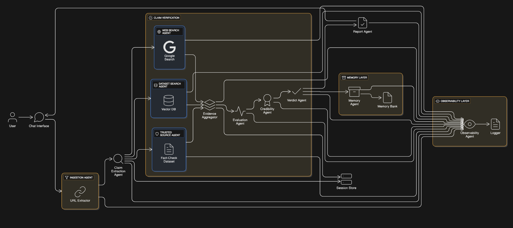

# 🔍 Fake News Detection Agent

> A multi-agent AI system for automated fact-checking to detect fake news using Google ADK, Gemini, and intelligent memory management.

[](https://github.com/google/adk)
[](https://ai.google.dev/)

**Live Demo:** [Try it on Hugging Face Spaces](https://huggingface.co/spaces/nilayj1296/fake-news-agent)

---

## 📋 Table of Contents

- [Problem Statement](#-problem-statement)
- [Solution Overview](#-solution-overview)
- [Architecture](#️-architecture)
- [Key Features](#-key-features)
- [Technology Stack](#️-technology-stack)
- [Installation & Setup](#-installation--setup)
- [Future Enhancements](#-future-enhancements)

---

## 🚨 Problem Statement

Misinformation and fake news have become critical threats to informed decision-making in the digital age. According to recent studies:

- Worldwide about **20-30%** of people get their news from social media platforms
- **Fake news spreads 6x faster** than accurate information on social networks
- Manual fact-checking is **time-intensive and doesn't scale** with the volume of content

**Key Challenges:**
1. **Volume:** Millions of articles published daily make manual verification impossible
2. **Speed:** Misinformation spreads faster than fact-checkers can respond
3. **Complexity:** Claims often require cross-referencing multiple sources
4. **Context:** Understanding nuanced claims requires domain knowledge
5. **Trust:** Users need transparent, evidence-based verdicts

---

## 💡 Solution Overview

**Fake News Detection Agent** is an intelligent multi-agent system that automates the fact-checking process using:

✅ **Multi-Agent Architecture** - Specialized agents for ingestion, extraction, verification, and aggregation  
✅ **Dual-Source Verification** - FAISS knowledge base + real-time Google Search  
✅ **Smart Memory System** - Caches previous verifications with SQLite for instant retrieval  
✅ **Batch API Optimization** - Reduces verification time and API costs  
✅ **Sequential Pipeline** - Orchestrates complex workflows with Google ADK  

### Value Proposition

- 🎯 **Evidence-Based** - Aggregates multiple sources before making a verdict
- 💾 **Memory-Enabled** - Learns from previous verifications to improve speed
- 🔄 **Scalable** - Batch processing and parallel retrieval handle high volumes
- 🌐 **Real-Time** - Combines static knowledge base with live web search

---

## 🏗️ Architecture



---

## ✨ Key Features

### 1. **Multi-Agent Sequential Pipeline**
Built on Google's Agent Development Kit (ADK), the system coordinates 5 specialized agents in a sequential workflow:
- **IngestionAgent**: URL content extraction
- **ClaimExtractionAgent**: Heuristic-based claim identification
- **VerificationAgent**: Parallel evidence retrieval + batch evaluation
- **AggregatorAgent**: Weighted verdict generation
- **FactCheckSequentialAgent**: Pipeline orchestrator

### 2. **Dual-Source Verification**
- **FAISS Vector Database**: Pre-indexed fact-checking knowledge base for instant retrieval
- **Google Search**: Real-time web search via Gemini for current events
- **Parallel Execution**: Both sources queried simultaneously using ThreadPoolExecutor

### 3. **Smart Memory System**
- **Claim Caching**: Stores verified claims with verdicts, and timestamps
- **Session Management**: Tracks user interactions across sessions


### 4. **Comprehensive Reporting**
- Structured fact-check reports with claim-level analysis
- Evidence source attribution (FAISS vs Web)
- Confidence scores and verdict distribution
- Session statistics dashboard

---

## 🛠️ Technology Stack

| Component | Technology | Purpose |
|-----------|-----------|---------|
| **Agent Framework** | Google ADK | Multi-agent orchestration |
| **LLM** | Gemini 2.5 Flash | Evidence evaluation & generation |
| **Vector Database** | FAISS | Semantic search over knowledge base |
| **Embeddings** | HuggingFace (multilingual-e5-small) | Text vectorization |
| **Web Search** | Google Search (via Gemini) | Real-time information retrieval |
| **Memory Store** | SQLite (WAL mode) | Session & verdict persistence |
| **Web Scraping** | BeautifulSoup4 | URL content extraction |
| **UI Framework** | Gradio | Interactive web interface |
| **Deployment** | Hugging Face Spaces | Free cloud hosting |

---

## 📦 Installation & Setup

### Prerequisites
- Python 3.9+
- Gemini API Key ([Get one here](https://ai.google.dev/))

### 1. Clone the Repository
```bash
git clone https://github.com/YOUR_USERNAME/fake-news-agent.git
cd fake-news-agent
```

### 2. Install Dependencies
```bash
pip install -r requirements.txt
```

### 3. Set Up Environment Variables
Create a `.env` file in the project root:
```bash
GEMINI_API_KEY=your_gemini_api_key_here
```

### 4. Prepare FAISS Index (Optional)
If you have a pre-built FAISS index, place it in:
```
data/embeddings/
  ├── index.faiss
  └── index.pkl
```

### 5. Run the Application

**CLI Mode:**
```bash
python backend/main.py
```

**Gradio UI:**
```bash
gradio run_ui.py
```

---

### Web Interface (Gradio)

1. Paste a news article URL or raw text.
2. Click "Verify" button.
3. View real-time analysis with verdict, confidence, and detailed report.
4. Explore cached claims and session history.

---

## 🚀 Future Enhancements

- [ ] **Multi-Language Support**: Expand to non-English articles
- [ ] **Real-Time Monitoring**: Track trending fake news topics
- [ ] **User Feedback Loop**: Allow users to flag incorrect verdicts
- [ ] **Advanced Embeddings**: Switch to domain-specific models (e.g., fact-checking BERT)
- [ ] **A2A Protocol**: Enable agent-to-agent communication for distributed verification
- [ ] **Evaluation Framework**: Automated testing against fact-checking benchmarks (e.g., FEVER, LIAR)
- [ ] **Browser Extension**: In-page fact-checking for social media posts
- [ ] **API Endpoints**: RESTful API for integration with other tools

---

## 🌟 Star This Repository

If you find this project useful, please consider giving it a ⭐ on GitHub!

---